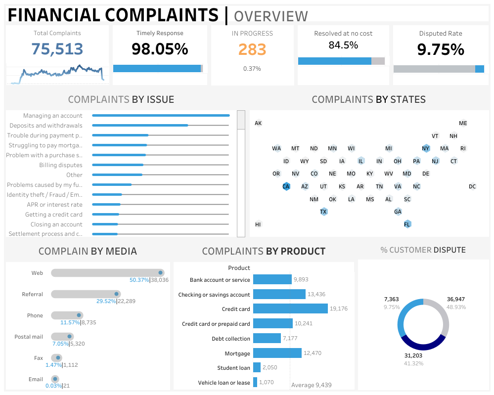

# 📊 Financial Complaints Dashboard

This project presents an interactive dashboard built to analyze consumer financial complaints in the United States. The objective is to gain insights into complaint trends, types of financial products involved, customer dispute rates, and resolution outcomes.

---

## 📌 Objective

To visually summarize and interpret financial complaints data to support:
- Identification of key complaint drivers
- Operational insights on resolution efficiency
- Product-specific performance issues
- State-wise complaint distribution

---

## 🗂️ Dashboard Overview

### Key Metrics Displayed:
- **Total Complaints**: 75,513
- **Timely Response Rate**: 98.05%
- **In Progress Cases**: 283 (0.37%)
- **Resolved at No Cost**: 84.5%
- **Dispute Rate**: 9.75%

---

## 📊 Breakdown by Dimensions

- **Complaint by Issue**: Managing accounts, deposits, billing disputes, fraud
- **Complaint by State**: Geographical trends across U.S.
- **Complaint by Product**: Credit cards, bank accounts, mortgages, student loans
- **Complaint by Media**: Web, phone, mail, referrals
- **% Customer Dispute**: Pie chart comparing disputed vs non-disputed complaints

---

## 🧰 Tools Used

- **Tableau Public**: For dashboard design and interactivity
- **MS Excel / CSV**: For data preprocessing and aggregation
- **PowerPoint** *(optional)*: For layout mocking

---

## 📁 Repository Structure
Fin_comp-dashboard/
│
├── Dashboard.png # Screenshot of the Tableau dashboard
├── README.md # Documentation for the project
├── financial_complaints.csv # (Add this if you include source data or sample data)
└── tableau-workbook.twb # (Optional: Add if sharing Tableau workbook)

# 📊 Financial Complaints Dashboard

## 📌 Objective

## 🗂️ Dashboard Overview

## 📊 Breakdown by Dimensions

## 🧰 Tools Used

## 📁 Repository Structure

## 📈 Outcome   ← Add this here

This dashboard provides a single-screen summary for financial services teams, regulators, or customer support operations to:
- Monitor top complaint categories
- Prioritize states with higher issues
- Identify products with dispute concerns
- Optimize channel strategies for resolution

## 📬 Author   ← Add this right after outcome

**Ameya Vedantwar**  
- [LinkedIn](https://www.linkedin.com/in/ameya-vedantwar-473b70139)  
- [GitHub Portfolio](https://github.com/ameyavedantwar)

